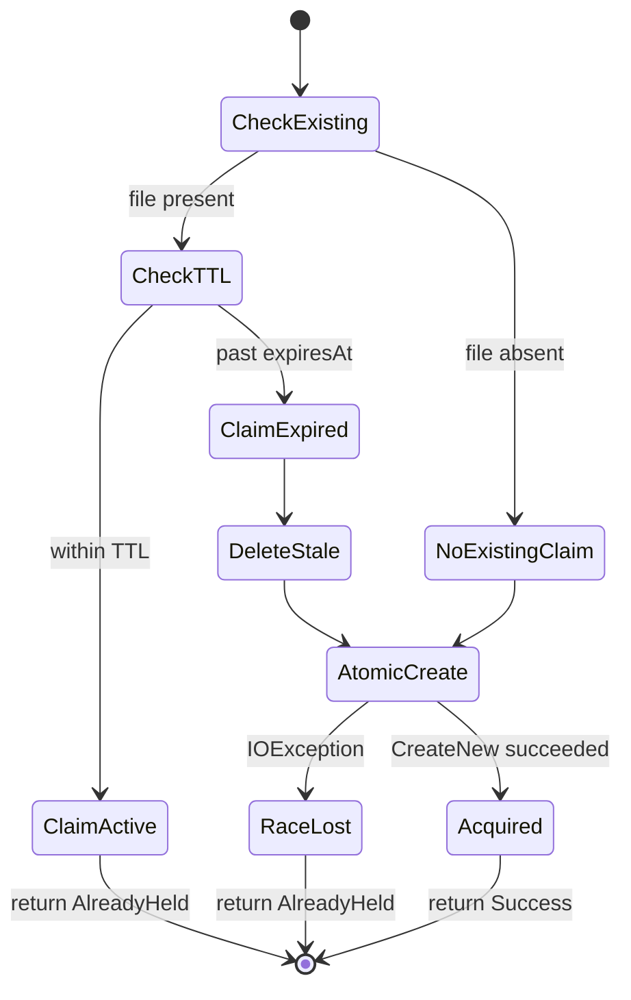

# Architecture

This section maps out the components, shows how they interact during acquire and release operations, and explains why each boundary exists.

## Components

The claim lock is built from four types. Each has one job.

**ClaimRecord** is the data model for a claim. It holds the resource name, owner identity, acquisition timestamp, and expiry timestamp. It serializes to and from JSON. This is the content of the claim file on disk.

**IClaimStore** defines how claim files are read, written, and deleted. The interface has four methods: `TryCreate` (atomic file creation), `Read` (load an existing claim), `Delete` (remove a claim file), and `Exists` (check presence). The abstraction lets you swap the filesystem implementation for an in-memory store in tests.

**FileClaimStore** implements `IClaimStore` using the filesystem. `TryCreate` uses `FileMode.CreateNew` for atomic creation. `Read` deserializes the JSON. `Delete` removes the file. `Exists` checks `File.Exists`.

**ClaimManager** is the orchestrator. It provides `Acquire`, `Release`, and `ForceOverride` operations. Each operation coordinates with the store and enforces the business rules: TTL checking, owner validation, and atomic transitions.

## Acquire Flow

1. **Check existing.** The manager asks the store whether a claim file exists for the resource.
2. **Check TTL.** If a claim exists, read it and compare `expiresAt` to the current time. If the claim is still active, return "already held" with details of the current holder.
3. **Delete stale.** If the claim has expired, delete the stale file.
4. **Atomic create.** Write a new claim file using `FileMode.CreateNew`. If another process raced and created the file first, the `IOException` is caught and "already held" is returned.
5. **Return result.** On success, return the new claim record. The caller holds the lock.

## Release Flow

1. **Read claim.** Load the existing claim file.
2. **Check owner.** If the file's owner matches the caller's owner identity, delete the file. If it doesn't match, do nothing — non-owner release is a no-op.

## Force Override Flow

1. **Delete existing.** Remove the claim file unconditionally, regardless of owner or TTL.
2. **Log takeover.** Write a notice indicating who overrode whose claim.
3. **Atomic create.** Write a new claim file with the overriding owner's identity.

## Recipe-Box Example

| Component | Recipe-Box Equivalent |
|---|---|
| ClaimRecord | A card on the counter: "garlic-chicken, claimed by chef-alice, expires 2:32 PM" |
| FileClaimStore | The kitchen counter where cards are placed and removed |
| ClaimManager | The kitchen rules: one card per recipe, expired cards get swept, only the card's chef can remove it |

Three chefs start their shift. Each checks the counter for unclaimed recipes, places a card, and starts cooking. If a chef walks out mid-prep, their card expires after the TTL and another chef picks up where they left off.
